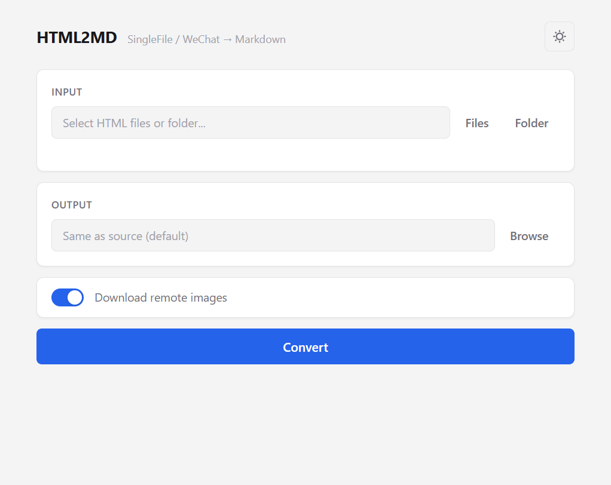

# wx-article-to-markdown

[](https://github.com/hss-ai/wx-article-to-markdown/actions/workflows/build.yml)

将 SingleFile 保存的网页（微信公众号、知乎、掘金、少数派等）一键转换为 Markdown，自动提取图片到 `assets/` 目录。



## Features

- **浏览器插件** — Chrome / Edge 一键转换当前网页为 Markdown + 图片 ZIP
- **Electron 跨平台桌面应用** — Windows / macOS / Linux
- **Windows 绿色免安装版** — 单个 exe，双击即用
- **智能内容提取** — 自动适配微信公众号、知乎、掘金、少数派、Medium、Notion 等主流站点
- **图片自动处理** — 优先提取 SingleFile 内联图片，无需网络
- **Python CLI** — 轻量命令行替代方案，支持交互模式

## Download

前往 [Releases](https://github.com/hss-ai/wx-article-to-markdown/releases) 下载对应平台安装包：

| Platform | Format | Notes |
|----------|--------|-------|
| Windows | `html2md-{version}-portable.exe` | 绿色免安装，双击即用 |
| Windows | `html2md-setup-{version}.exe` | NSIS 安装器 |
| macOS | `html2md-{version}.dmg` | |
| Linux | `html2md-{version}.AppImage` | |

## Quick Start

### 方式一：Electron 桌面应用

```bash
# 安装依赖
npm install

# 开发模式运行
npm start

# 打包
npm run build:win     # Windows
npm run build:mac     # macOS
npm run build:linux   # Linux
```

打开应用 → 选择文件或文件夹 → 设置输出目录 → 点击 **Convert**。

### 方式二：Python 命令行

```bash
pip install -r requirements.txt

# 交互模式（直接运行，按提示操作）
python html2md.py

# 单文件 / 批量
python html2md.py article.html
python html2md.py ./saved_pages/

# 指定输出目录 / 跳过下载
python html2md.py article.html -o ./output/ --no-download
```

### 方式三：浏览器插件（Chrome / Edge）

在浏览器中直接转换当前网页，无需保存 HTML 文件：

1. 打开 `chrome://extensions/`（或 `edge://extensions/`）
2. 开启「开发者模式」
3. 点击「加载已解压的扩展程序」，选择本项目的 `extension/` 目录
4. 打开任意文章页面，点击工具栏的 HTML2MD 图标
5. 点击 **Convert & Download**，自动下载 `article.zip`（含 Markdown + 图片）

插件会自动识别微信公众号、知乎等站点，提取正文、标题、作者，打包为 ZIP 下载。

## 支持的网站

| 网站 | 选择器 | 备注 |
|------|--------|------|
| 微信公众号 | `#js_content` | 完整支持 |
| 知乎专栏 | `.Post-RichTextContainer` | 完整支持 |
| 掘金 | `.article-content` | 完整支持 |
| 少数派 | `.article-content` | 完整支持 |
| Medium | `.meteredContent` | 完整支持 |
| InfoQ | `.article__detail` | 完整支持 |
| Notion 导出 | `.page-body` | 完整支持 |
| 通用 | `<article>` 标签 | 尽力提取 |

其他网站通常也能工作 — 工具会依次尝试多种选择器。

## 发布流程（Semantic Versioning）

标签格式：`v1.0.0`

| 类型 | 格式 | 示例 | 场景 |
|------|------|------|------|
| Patch | v1.0.X | v1.0.1 | Bug 修复 |
| Minor | v1.X.0 | v1.1.0 | 新功能（向后兼容） |
| Major | vX.0.0 | v2.0.0 | 破坏性变更 |

```bash
# 更新 package.json 中的 version
# 然后：
git tag v1.0.0
git push origin v1.0.0
# GitHub Actions 自动构建并发布到 Releases
```

## 项目结构

```
├── extension/                # 浏览器插件 (Chrome / Edge)
│   ├── manifest.json         # Manifest V3
│   ├── content.js            # 页面内容提取脚本
│   ├── popup/                # 弹窗 UI
│   └── icons/                # 插件图标
├── main.js                   # Electron 主进程
├── preload.js                # 预加载脚本（IPC 桥接）
├── src/converter.js          # JS 转换引擎（cheerio + turndown）
├── renderer/                 # GUI 界面
├── .github/workflows/        # CI/CD
├── core.py                   # Python 转换引擎
├── html2md.py                # Python CLI
├── gui.py                    # Python tkinter GUI
└── build.py                  # PyInstaller 打包脚本
```

## License

MIT
